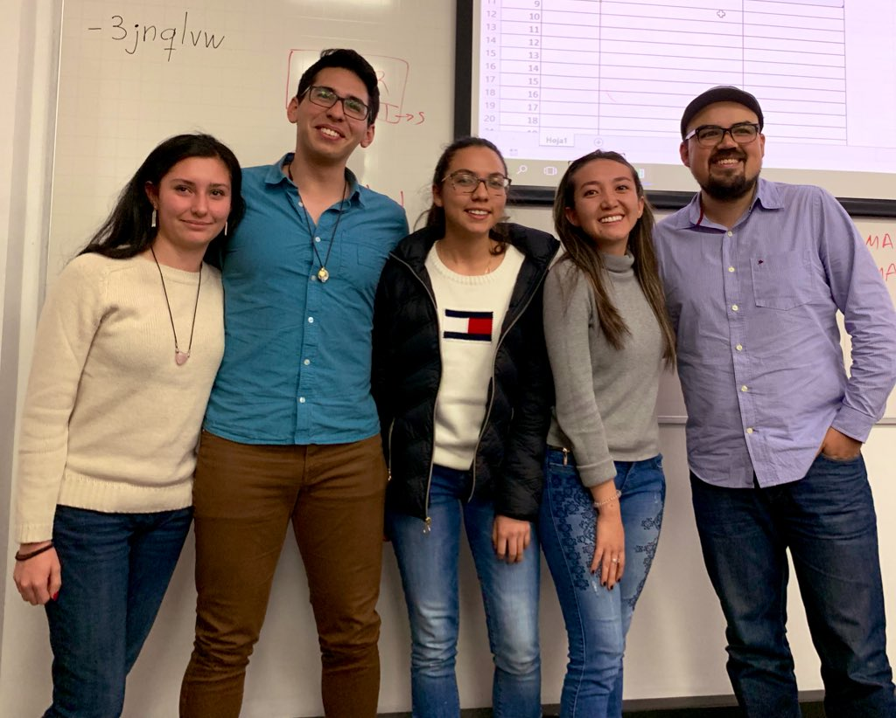

# NVIDIA Bootcamp 2019
Durante el 13 y 14 de Junio se llevo a cabo el NVIDIA bootcamp en el marco workshop HPC (High Performance Computing) organizado por el departamento de Matemáticas Aplicadas y Ciencias de la Computación de la Universidad del rosario. El evento consistía en acelerar la velocidad de ejecución de un algoritmo de simulación climática utilizando estrategias de programación paralela. 

En el evento, Stephany Bonilla, Manuela Bravo, Kateryne Bonilla y David Calles estudiantes del programa de Ingeniería electrónica representaron a la Universidad Javeriana junto con la asesoría de German Montañez (profesor de cátedra) y lograron quedar en primer puesto. Como resultado, el equipo logro reducir el tiempo de ejecución del programa de 4.5 minutos a solo 3.59 segundos.

# El equipo ganador

# Caracteristicas del Hardware
GPU Nvidia V100

# Para probar el codigo
https://app.linuxacademy.com/hands-on-labs/710f920a-402c-4189-a10c-793e76923811

